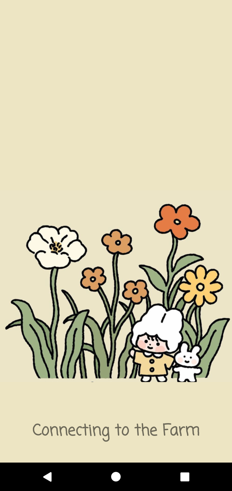

# The Farm Connection

This application is designed to connect farmers and consumers. It's not only for consumers to buy products directly from farmers, but they can also choose to buy plants, vegetables or flowers seeds that farmers would like to help grow in their land. As a farmer, you can publish the plants that you would like to have in your farm and set a price for it, and you need to update the status of plants with pictures from time to time. As a customer, you can select the plants you like from farms around you, and if it's a big tree with a lot of fruits, for example, an apple tree, you can try to share it with your friends or other consumers. Also, when you want to visit the farm and your plants, you can make an appointment before your arrival.

  
  
  

## ⚡ Features

🎯 **Multiple Language** - Support English and Mandarin.

🎯 **More and More Plants** - Farmers can add new plants that they would like to provide.

🎯 **Stay with Your Plants** - See recent pictures of your plants, recent messages from farmers or make an appointment to see it.

🎯 **Notifications** - You'll be notified when it's time to take something home, for example, your apples and sunflowers!

#### Designed & Developed by [Yajing Li](https://www.github.com/LiArAu)

## Contribute
Found a bug, please [create an issue](https://github.com/LiArAu/TheFarmConnection/issues)
